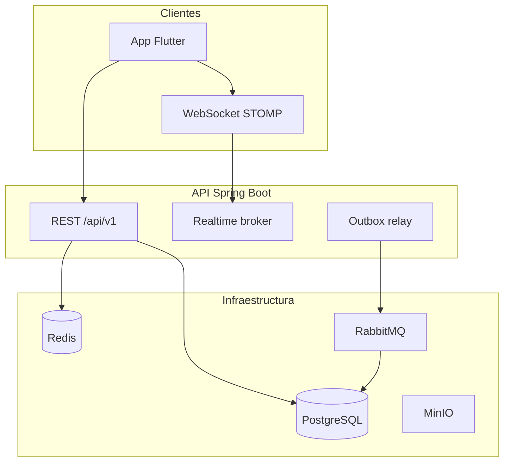

# BidStream

Plataforma de **subastas en vivo** — monorepo con backend Spring Boot (arquitectura hexagonal) y app Flutter.


> GIF: dos dispositivos pujando en tiempo real sobre un lote LIVE (generado tras `make seed`).

## Stack

| Capa | Tecnología |
|------|------------|
| Backend | Java 21, Spring Boot 3, PostgreSQL, Redis, RabbitMQ, MinIO |
| Móvil | Flutter, Riverpod, Dio, STOMP |
| Observabilidad | Micrometer, Prometheus, Grafana, logs JSON |
| CI | GitHub Actions (backend, móvil, Docker) |

## Arquitectura



Topología de colas: [docs/rabbitmq-topology.md](docs/rabbitmq-topology.md)

## Levantar en un comando (producción local)

```bash
cp .env.example .env
docker compose -f docker-compose.prod.yml up -d
make seed
```

- API: http://localhost:8080
- Grafana: http://localhost:3000 (admin / admin)
- Prometheus: http://localhost:9090 (red interna; expuesto en compose para demo)

### Credenciales demo

| Rol | Email | Password |
|-----|-------|----------|
| Comprador | `demo-buyer@bidstream.demo` | `demo1234` |
| Vendedor | `demo-seller@bidstream.demo` | `demo1234` |

Tras `make seed`: ~40 lotes (5 LIVE con cierre próximo), ~300 pujas, 8 categorías raíz.

## Desarrollo local

```bash
cp .env.example .env
docker compose up -d          # solo infra (Postgres 5433, Redis, RabbitMQ, MinIO)
cd backend && ./gradlew bootRun
cd mobile && flutter run --dart-define=API_BASE_URL=http://10.0.2.2:8080/api/v1
```

## Observabilidad

- Métricas de negocio: `GET /actuator/prometheus`
- Health: `/actuator/health/liveness`, `/actuator/health/readiness`
- Dashboard Grafana provisionado: `ops/grafana/dashboards/bidstream.json`
- Prueba de carga: `k6 run ops/k6/bid-storm.js` — ver [docs/CARGA.md](docs/CARGA.md)

## Análisis y aprendizaje

- [docs/ANALISIS-CONCURRENCIA.md](docs/ANALISIS-CONCURRENCIA.md) — locks, versionado optimista, contención
- [docs/ANALISIS-RENDIMIENTO.md](docs/ANALISIS-RENDIMIENTO.md) — cache, búsqueda
- [docs/CARGA.md](docs/CARGA.md) — k6, umbrales, cuello de botella
- [CONCEPTOS.md](CONCEPTOS.md) — fichas de conceptos SPEC-06 y SPEC-10
- [APRENDIZAJES.md](APRENDIZAJES.md) — cierre del proyecto

## Calidad

```bash
make check    # Spotless, Checkstyle, tests backend + Flutter
```

## Estructura

```
backend/     domain · application · infrastructure · api
mobile/      Flutter
ops/         Prometheus, Grafana, k6
scripts/     check.sh, seed.sh
```
