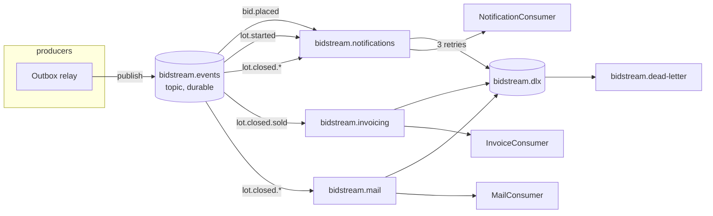

# Topología RabbitMQ — BidStream

| Cola | Routing keys | Consumidor |
|------|----------------|------------|
| `bidstream.notifications` | `bid.placed`, `lot.started`, `lot.closed.*` | Inserta en `notifications` + STOMP `/user/queue/notifications` |
| `bidstream.invoicing` | `lot.closed.sold` | Crea `invoices` (unique por `lot_id`) |
| `bidstream.mail` | `lot.closed.*` | Correo vía MailHog al ganador y vendedor |

Mensajes persistentes; publisher confirms activados en el relay.
